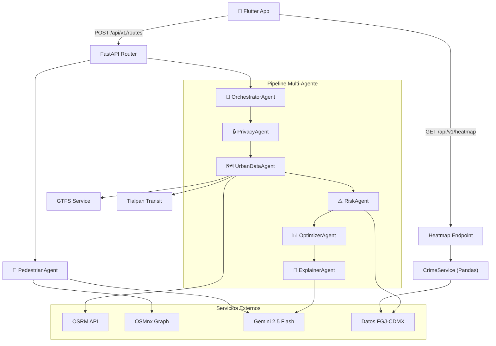

# Arquitectura del Backend — ConciencIA API

## Diagrama de Arquitectura



## Estructura de Directorios

```
backend/
├── main.py                  # Entry point FastAPI + lifespan
├── core/
│   ├── config.py            # Settings (pydantic-settings + .env)
│   └── security.py          # RateLimitMiddleware
├── api/v1/
│   ├── router.py            # Router principal
│   ├── routes.py            # POST /routes — cálculo de rutas
│   └── heatmap.py           # GET /heatmap — mapa de calor
├── agents/
│   ├── base.py              # BaseAgent, AgentContext, AgentResult
│   ├── orchestrator.py      # Pipeline secuencial de 5 agentes
│   ├── privacy.py           # Validación y sanitización
│   ├── urban_data.py        # Recolección de rutas candidatas
│   ├── risk.py              # Scoring de riesgo por segmento
│   ├── optimizer.py         # Selección top-3 con diversidad
│   ├── explainer.py         # Generación de texto con Gemini
│   └── pedestrian.py        # Rutas peatonales OSMnx (independiente)
├── services/
│   ├── gemini_service.py    # Cliente LLM (OpenRouter/Gemini)
│   ├── osm_service.py       # Cliente OSRM
│   ├── gtfs_service.py      # Datos GTFS Metro/Metrobús
│   ├── cdmx_data_service.py # API abierta de incidentes CDMX
│   ├── tlalpan_transit_service.py  # Paradas Tren Ligero + RTP (OSMnx)
│   └── crime_service.py     # Carga CSV crímenes + consulta bbox
├── schemas/
│   ├── request.py           # RouteRequest, TransportMode, TravelPriority
│   ├── response.py          # RouteResponse, RouteOption, Segment
│   └── pedestrian.py        # PedestrianRoute, PedestrianMetrics
├── data/
│   └── tlalpan_transit.json # Datos estáticos de tránsito local
├── analytics/
│   └── Data/Crimes/         # Dataset FGJ-CDMX 2024
├── Dockerfile
├── requirements.txt
└── .env.example
```

## Flujo de una Solicitud

```mermaid
sequenceDiagram
    participant App as Flutter App
    participant API as FastAPI
    participant Orch as Orchestrator
    participant Priv as Privacy
    participant Data as UrbanData
    participant Risk as Risk
    participant Opt as Optimizer
    participant Exp as Explainer
    participant LLM as Gemini

    App->>API: POST /api/v1/routes
    API->>Orch: process_request(RouteRequest)
    Orch->>Priv: Validar coordenadas + sanitizar
    Priv-->>Orch: OK
    Orch->>Data: Generar rutas candidatas (OSRM + GTFS)
    Data-->>Orch: N rutas candidatas
    Orch->>Risk: Asignar risk_score por segmento
    Risk-->>Orch: Rutas con scores
    Orch->>Opt: Seleccionar top 3 (diversidad + priority)
    Opt-->>Orch: 3 mejores rutas
    Orch->>Exp: Explicar rutas
    Exp->>LLM: Prompt con métricas + priority + modos
    LLM-->>Exp: JSON con explicaciones
    Exp-->>Orch: Rutas explicadas
    Orch-->>API: RouteResponse
    API-->>App: JSON Response
```

## Patrón Multi-Agente

Cada agente hereda de `BaseAgent` que provee:

- **Logging** estructurado por agente
- **Medición de tiempo** automática
- **Fallback** si `execute()` falla

```python
class BaseAgent(ABC):
    async def run(context) -> AgentResult   # Template method
    async def execute(context) -> AgentResult  # Implementar
    async def fallback(context, error) -> AgentResult  # Opcional
```

Los agentes se comunican a través de `AgentContext` (diccionario compartido con `set()`/`get()`).

## API Endpoints

| Método | Ruta | Descripción |
|--------|------|-------------|
| `POST` | `/api/v1/routes` | Calcula las 3 mejores rutas |
| `GET` | `/api/v1/heatmap` | Crímenes en bounding box (max 2000) |
| `GET` | `/health` | Health check |

## Tecnologías

| Tecnología | Uso |
|-----------|-----|
| FastAPI | Framework web async |
| Pydantic v2 | Validación de schemas |
| OSMnx + NetworkX | Grafos peatonales |
| OSRM | Routing vehicular/bici |
| Gemini 2.5 Flash | Explicaciones IA |
| Pandas | Procesamiento de crímenes |
| Docker | Contenedorización |
